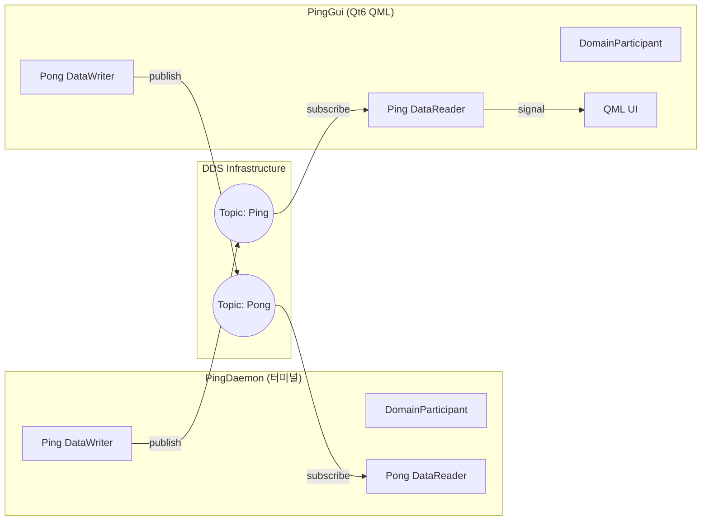
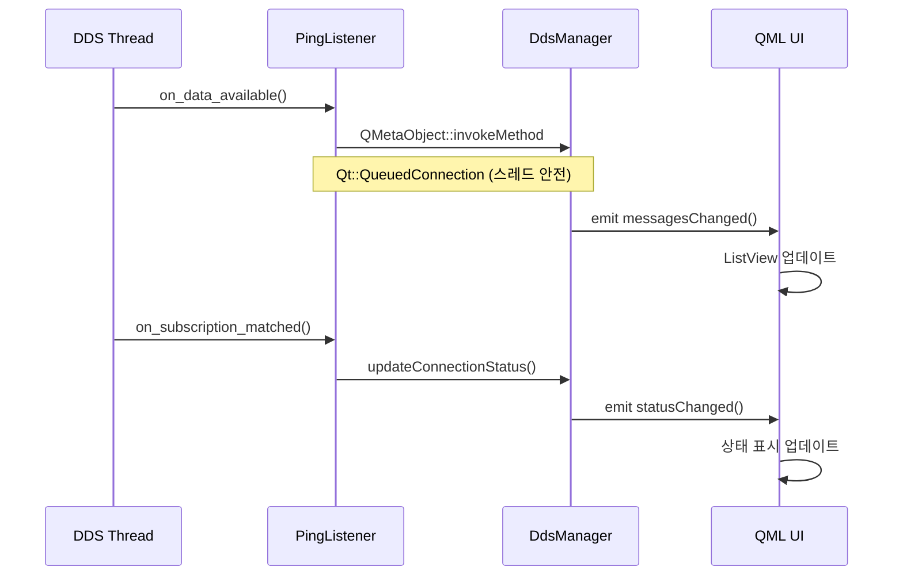

# Architecture: RTI Ping-Pong with Qt6 QML

이 문서는 RTI Connext DDS와 Qt6 QML을 사용한 Ping-Pong 예제의 아키텍처를 설명합니다.

## 1. 시스템 개요

본 프로젝트는 **Daemon**(터미널)과 **Qt GUI**(QML)가 DDS를 통해 통신하는 구조입니다.



---

## 2. 컴포넌트 설명

### 2.1 PingDaemon

터미널에서 실행되는 백그라운드 프로세스입니다.

| 역할 | 설명 |
|------|------|
| Ping 발행 | 1초 간격으로 Ping 토픽에 메시지 전송 |
| Pong 수신 | `PongListener::on_data_available()` 콜백으로 응답 수신 |
| 로그 출력 | 터미널에 송수신 상태 출력 |

### 2.2 PingGui (Qt6 QML)

Qt Quick을 사용한 GUI 애플리케이션입니다.

| 컴포넌트 | 설명 |
|----------|------|
| `DdsManager` | DDS 엔티티 관리 및 Qt 시그널 연결 |
| `PingListener` | DDS 콜백을 Qt 스레드로 전달 |
| `Main.qml` | 카드 기반 UI (상태, 메시지 목록) |

---

## 3. DDS 콜백 구조



---

## 4. 연결 상태 감지

`on_subscription_matched` 콜백을 통해 상대 DataWriter의 연결/해제를 감지합니다.

| 이벤트 | current_count | 동작 |
|--------|---------------|------|
| Daemon 연결 | 1 | "Connected (1 writer)" 표시 |
| Daemon 해제 | 0 | "Daemon disconnected" 표시 |

---

## 5. 데이터 모델 (IDL)

`ping_pong.idl`에 정의된 메시지 구조:

```idl
struct PingPongMessage {
    string sender_id;    // 발신자 ("Daemon" 또는 "QtApp")
    long sequence_num;   // 시퀀스 번호
};
```

---

## 6. QoS 설정

`USER_QOS_PROFILES.xml`에서 통신 품질을 설정합니다.

| 설정 | 값 | 설명 |
|------|----|----|
| Reliability | RELIABLE | 패킷 유실 시 자동 재전송 |
| History | KEEP_LAST (depth=1) | 최신 메시지 1개만 보관 |

---

## 7. 파일 구조

```
daemon/
└── main.cpp              # DaemonApp, PongListener 클래스

gui/
├── main.cpp              # Qt 앱 진입점
├── DdsManager.hpp        # DDS-Qt 브리지 (헤더)
├── DdsManager.cpp        # DDS 초기화 및 메시지 처리
└── Main.qml              # QML UI 정의
```

---

## 8. 스레드 모델

| 스레드 | 역할 |
|--------|------|
| Qt Main Thread | QML UI 렌더링, 이벤트 처리 |
| DDS Receive Thread | DataReader 콜백 실행 |

`QMetaObject::invokeMethod(..., Qt::QueuedConnection)`을 통해 스레드 간 안전한 통신을 보장합니다.
